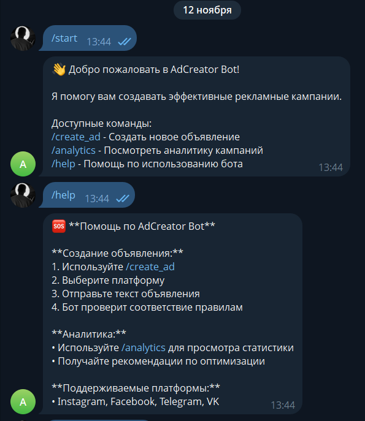
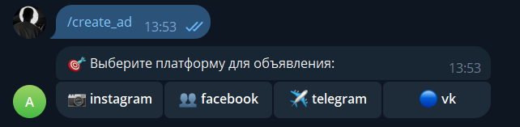
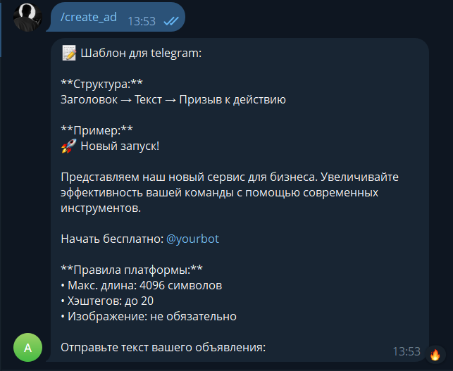
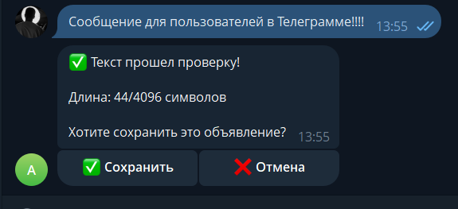
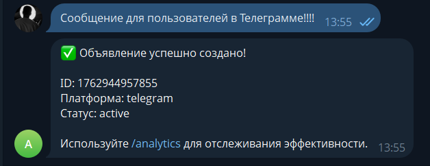
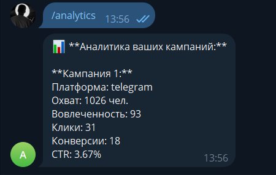

# AdCreator Bot

Telegram‑бот для рекламного агентства "AdCreator". Бот помогает создавать и управлять рекламными кампаниями, генерировать текст объявлений, проверять соответствие правилам площадок и анализировать эффективность кампаний.

---

## Возможности

- `/start` — приветственное сообщение и обзор возможностей
- `/create_ad` — **пошаговая команда (FSM)**: создание объявления с выбором платформы, шаблона, текста и целевой аудитории
- `/analytics` — аналитика кампаний с выбором типа, периода и метрик
- `/help` — список команд и справка

> Требование «пошаговые команды реализованы с помощью конечного автомата» — выполнено: диалог ведётся через состояния `IDLE → AWAIT_ROWS → AWAIT_COLS → IDLE`.

---

## Технологии

- **Node.js** (ES‑modules)
- **node-telegram-bot-api** — интеграция с Telegram
- **dotenv** — чтение переменных окружения из `.env`
- **Jest** — модульные тесты утилит (coverage)
- **ESLint** — проверка качества кода

---

## Структура проекта

```
solutions/student-17/
├── coverage/
├── images/
├── node_modules/
├── src/
│   ├── bot.js
│   ├── constants.js
│   ├── handlers.js
│   ├── index.js
│   └── state.js
├── tests/
│   ├── bot.test.js
│   ├── constants.test.js
│   ├── handlers.test.js
│   ├── index.test.js
│   └── state.test.js
├── .env (Ваш **BOT_TOKEN**)
├── .env.example 
├── eslint.config.js
├── jest.config.json
├── package-lock.json
├── package.json
└── Readme.md

```

## Подготовка и запуск

1) **Установить зависимости**
```bash
npm install
```

2) **Создать файл `.env`** в корне (см. `.env.example`):
```env
BOT_TOKEN = ваш_токен_бота
```

3) **Запустить бота**
```bash
npm start
```
Бот перейдёт в режим long polling и будет готов принимать команды в Telegram.

> Остановить: `Ctrl + C` в терминале.

Для разработки с авто‑перезапуском:
```bash
npm run dev
```

---

## Скрипты

```json
  "scripts": {
    "start": "node src/index.js",
    "dev": "nodemon src/index.js",
    "test": "node --experimental-vm-modules node_modules/jest/bin/jest.js",
    "test:coverage": "node --experimental-vm-modules node_modules/jest/bin/jest.js --coverage",
    "test:watch": "node --experimental-vm-modules node_modules/jest/bin/jest.js --watch",
    "lint": "eslint src/**/*.js tests/**/*.js",
    "lint:fix": "eslint src/**/*.js tests/**/*.js --fix"
  },
```

---

## Тестирование и покрытие

Запуск тестов:
```bash
npm test
```

Отчёт покрытия (coverage):
```bash
npm run test:coverage
```

### Coverage threshold
В проекте настроен порог покрытия 80% для всех метрик (branches, functions, lines, statements).
---

## Конечные автоматы (FSM) для пошаговых команд

### Команда `/create_ad`
**Состояния:** `IDLE → SELECTING_PLATFORM → SELECTING_TEMPLATE → ENTERING_AD_TEXT → ENTERING_AUDIENCE → VALIDATING → IDLE`

**Процесс:**
1. Выбор платформы (Instagram, Facebook, Telegram, VK)
2. Выбор шаблона объявления
3. Ввод текста объявления
4. Определение целевой аудитории
5. Автоматическая проверка по правилам платформы
6. Генерация финального объявления


### Особенности FSM:
- **Изоляция состояний** — каждый пользователь имеет отдельный экземпляр автомата
- **Валидация ввода** — проверка корректности на каждом шаге
- **Возможность отмены** — команда `/cancel` на любом этапе
- **Обработка конфликтов** — предупреждение о незавершенных процессах
- **Graceful shutdown** — состояния сбрасываются при перезапуске

---

## Поддерживаемые платформы и функции

### Платформы:
- 📱 **Instagram** — визуальный контент, ограничение 2200 символов
- 👥 **Facebook** — детальные посты, ограничение 63206 символов
- 📢 **Telegram** — каналы и чаты, поддержка Markdown
- 🔵 **VK** — сообщества, молодёжная аудитория
---

## Валидация и безопасность

- **Валидация входящих сообщений** — проверка структуры Telegram сообщений
- **Проверка правил платформ** — автоматическая проверка длины, хештегов, запрещенных слов
- **Санатизация ввода** — очистка пользовательского ввода от опасных символов
- **Валидация числовых значений** — проверка диапазонов и форматов

---

## Пример использования

1. **Создание объявления для Instagram:**
   ```
1) /create_ad → 
2) Выбор платформы: Instagram →
3) Подсказка для написания текста
   📝 Шаблон для instagram:

   **Структура:**
   Заголовок → Описание → Призыв к действию → Хэштеги

   **Пример:**
   🔥 Акция! Только сегодня скидка 50%!

   Успей купить лучшие товары по выгодной цене!

   👉 Переходи по ссылке в профиле

   #акция #скидка #покупки

   **Правила платформы:**
   • Макс. длина: 2200 символов
   • Хэштегов: до 30
   • Изображение: обязательно

4) Отправьте текст вашего объявления: →
5) Вводите свой текст: "Отличный продукт!" →
6) Проверка на соответсвие правил
   ✅ Текст прошел проверку!

   Длина: 115/2200 символов

   Хотите сохранить это объявление? →
7) Сохраняете и теперь выволится →
8) ✅ Объявление успешно создано!

   ID: 1763197892087
   Платформа: instagram
   Статус: active

   Используйте /analytics для отслеживания эффективности.
9) Все!

## Примеры работы

> Скриншоты находятся в папке `images/`.






